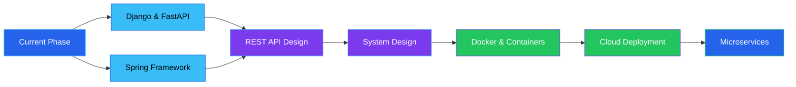

```markdown
<div align="center">

<!-- ANIMATED WAVE HEADER -->


<!-- TYPING ANIMATION -->
<div style="margin: 40px 0;">
  
</div>

<!-- HERO METADATA -->
<table align="center" style="margin: 30px auto;">
<tr>
<td align="center" style="padding: 20px;">

</td>
<td align="center" style="padding: 20px;">

</td>
<td align="center" style="padding: 20px;">

</td>
<td align="center" style="padding: 20px;">

</td>
</tr>
</table>

<!-- SOCIAL LINKS -->
<div style="margin: 40px 0;">
  
  [](https://aniketbiradar-official.github.io/portfolio/)
  [](https://www.linkedin.com/in/aniket-biradar-a6b775371/)
  [](https://github.com/aniketbiradar-official)
  [](mailto:aniket@example.com)

</div>

<!-- PROFILE VIEWS -->


</div>

<br/>

<!-- DECORATIVE DIVIDER -->


<br/>

<!-- ABOUT SECTION -->
<div align="center">

## ⚡ Engineering Software That Matters

</div>

<div style="margin: 0 auto; max-width: 900px; padding: 0 20px;">

```yaml
mindset:
  focus: "Building production-oriented systems with clean architecture"
  approach: "Engineering solutions, not just writing code"
  philosophy: "Maintainability, scalability, and readability first"
  
current_work:
  - Developing backend systems with Django, FastAPI, and Spring
  - Building database-driven applications with MySQL and MongoDB
  - Creating desktop automation tools with enterprise-grade structure
  - Implementing MVC patterns and layered architecture
  - Writing self-documenting code with comprehensive logging
  
engineering_principles:
  - SOLID design thinking
  - Separation of concerns
  - Configuration-driven development
  - Environment-based deployments
  - Comprehensive error handling
  - Production-ready folder structures

learning_path:
  - System design and architectural patterns
  - RESTful API development and microservices
  - Cloud deployment and containerization
  - Advanced database optimization
  - Security best practices
  
github_philosophy: "Treating every repository as an engineering journal—documenting growth, learning from refactoring, and building reusable solutions for real-world problems"
```

</div>

<br/>

<!-- DECORATIVE DIVIDER -->


<br/>

<!-- TECH STACK SECTION -->
<div align="center">

## 🛠️ Technical Arsenal

</div>

<div align="center">
<table style="margin: 30px auto; border: none;">
<tr>
<td valign="top" width="33%" style="border: none;">

### Languages
<div align="center" style="margin: 20px 0;">
  


</div>
</td>

<td valign="top" width="33%" style="border: none;">

### Backend & Frameworks
<div align="center" style="margin: 20px 0;">


</div>
</td>

<td valign="top" width="33%" style="border: none;">

### Databases
<div align="center" style="margin: 20px 0;">


</div>
</td>
</tr>
</table>

<table style="margin: 20px auto; border: none;">
<tr>
<td valign="top" width="50%" style="border: none;">

### Libraries & Tools
<div align="center" style="margin: 20px 0;">


</div>
</td>

<td valign="top" width="50%" style="border: none;">

### Engineering Concepts
<div align="center" style="margin: 20px 0;">


</div>
</td>
</tr>
</table>

</div>

<br/>

<!-- DECORATIVE DIVIDER -->


<br/>

<!-- FEATURED PROJECTS -->
<div align="center">

## 🚀 Featured Engineering Projects

</div>

<div align="center" style="margin: 40px 0;">

<!-- PROJECT 1 -->
<details open>
<summary>

</summary>

<div align="left" style="padding: 30px; background: #0d1117; border-radius: 12px; margin: 20px;">

### 🏗️ Architecture Highlights

**Industry-standard web scraping system with enterprise-grade infrastructure**

```
Architecture
├── Configuration Management (Environment Variables)
├── Logging System (Multi-level logging)
├── Cloud-Ready Design (MongoDB Atlas)
├── GridFS for Binary Storage
├── SHA256 Deduplication
└── CLI Interface
```

**Engineering Stack**
- **Core**: Python, Selenium WebDriver
- **Database**: MongoDB Atlas, GridFS
- **Security**: SHA256 hashing, environment-based configs
- **DevOps**: Modular structure, production folder hierarchy

**Key Engineering Decisions**
- ✅ Separation of concerns with layered architecture
- ✅ Centralized configuration management
- ✅ Comprehensive error handling and logging
- ✅ Cloud-ready from day one
- ✅ Deduplication at storage layer
- ✅ Scalable CLI design

[](https://github.com/aniketbiradar-official)

</div>

</details>

<br/>

<!-- PROJECT 2 -->
<details>
<summary>

</summary>

<div align="left" style="padding: 30px; background: #0d1117; border-radius: 12px; margin: 20px;">

### 📊 Full-Featured Financial Manager

**Cross-platform desktop application with analytics and modern UI**

```
Features
├── Real-time Expense Tracking
├── Budget Management & Alerts
├── Visual Analytics (Charts/Graphs)
├── Dark Mode Support
├── CSV Export Functionality
├── Multi-Category Management
└── SQLite Local Database
```

**Engineering Stack**
- **GUI**: Tkinter with custom styling
- **Database**: SQLite with optimized queries
- **Deployment**: PyInstaller → Standalone .exe
- **Architecture**: Layered (UI → Business Logic → Data)

**Production Features**
- ✅ Installer creation for distribution
- ✅ Error-proof database transactions
- ✅ Data validation at every layer
- ✅ Responsive UI with UX considerations
- ✅ Export functionality for data portability

[](https://github.com/aniketbiradar-official)

</div>

</details>

<br/>

<!-- PROJECT 3 -->
<details>
<summary>

</summary>

<div align="left" style="padding: 30px; background: #0d1117; border-radius: 12px; margin: 20px;">

### 🏢 MVC-Based Web Application

**Role-based library management system with authentication**

```
System Architecture
├── MVC Pattern Implementation
├── User Authentication & Sessions
├── Role-Based Access Control (Admin/User)
├── CRUD Operations (Books, Members, Transactions)
├── MySQL Database Design
└── Servlet + JSP Architecture
```

**Engineering Stack**
- **Backend**: Java, Servlets, JSP
- **Database**: MySQL with normalized schema
- **Pattern**: MVC for separation of concerns
- **Security**: Session management, input validation

**Enterprise Concepts**
- ✅ Multi-user role management
- ✅ Transaction history tracking
- ✅ Database connection pooling
- ✅ Server-side validation
- ✅ Modular JSP components

[](https://github.com/aniketbiradar-official)

</div>

</details>

<br/>

<!-- PROJECT 4 -->
<details>
<summary>

</summary>

<div align="left" style="padding: 30px; background: #0d1117; border-radius: 12px; margin: 20px;">

### 🔧 Production-Ready Utility

**Batch PDF processing tool with comprehensive error handling**

```
Features
├── Tkinter GUI (File Selection)
├── Batch Merging Operations
├── Comprehensive Logging System
├── Exception Handling Pipeline
├── Input Validation
└── Progress Feedback
```

**Engineering Stack**
- **Core**: Python, PyPDF2
- **GUI**: Tkinter with modern widgets
- **Logging**: Multi-level logging system

**Engineering Principles**
- ✅ User-friendly error messages
- ✅ Graceful failure handling
- ✅ Activity logging for debugging
- ✅ Input sanitization

[](https://github.com/aniketbiradar-official)

</div>

</details>

</div>

<br/>

<!-- DECORATIVE DIVIDER -->


<br/>

<!-- ENGINEERING PHILOSOPHY -->
<div align="center">

## 💭 Engineering Philosophy

<div style="margin: 40px auto; max-width: 800px; padding: 40px; background: linear-gradient(135deg, #1e293b 0%, #0f172a 100%); border-radius: 16px; border: 1px solid #2563EB;">


<br/><br/>

```python
class EngineeringPrinciples:
    def __init__(self):
        self.core_values = {
            "readability": "Code should tell a story",
            "maintainability": "Future me will thank present me",
            "scalability": "Design for growth, not just now",
            "solid_thinking": "Principles over patterns",
            "refactoring": "Iteration leads to excellence",
            "documentation": "Code explains how, docs explain why"
        }
    
    def build_software(self):
        return "Systems that last, not just code that works"
```

</div>

</div>

<br/>

<!-- DECORATIVE DIVIDER -->


<br/>

<!-- LEARNING ROADMAP -->
<div align="center">

## 🎯 Current Learning Path

</div>

<div align="center">



<table style="margin: 30px auto;">
<tr>
<td align="center" width="25%">

### 🔄 Now
Django<br/>FastAPI<br/>Spring Basics

</td>
<td align="center" width="25%">

### 📡 Next
REST APIs<br/>Microservices<br/>System Design

</td>
<td align="center" width="25%">

### 🐳 Soon
Docker<br/>Kubernetes<br/>CI/CD

</td>
<td align="center" width="25%">

### ☁️ Future
AWS/GCP<br/>Scaling<br/>Architecture

</td>
</tr>
</table>

</div>

<br/>

<!-- DECORATIVE DIVIDER -->


<br/>

<!-- TIMELINE -->
<div align="center">

## 📅 Development Timeline

</div>

<div align="center" style="margin: 40px 0;">

<table style="margin: 0 auto;">
<tr>
<td align="center" style="padding: 20px;">

### 2024
**Foundation Year**

Started software development journey<br/>
Built Python automation projects<br/>
Explored data structures & algorithms<br/>
Developed first GUI applications

</td>
<td align="center" style="padding: 20px;">

### 2025
**Production Focus**

Java web development (JSP/Servlets)<br/>
Production-grade project architecture<br/>
Desktop applications with deployment<br/>
MongoDB Atlas & cloud integration<br/>
Aavishkar 2025 Research Presentation

</td>
<td align="center" style="padding: 20px;">

### 2026
**Scale & Deploy**

Django & FastAPI mastery<br/>
Spring Framework learning<br/>
Cloud deployments & Docker<br/>
Building comprehensive portfolio<br/>
Preparing for industry internships

</td>
</tr>
</table>

</div>

<br/>

<!-- DECORATIVE DIVIDER -->


<br/>

<!-- ACHIEVEMENTS -->
<div align="center">

## 🏆 Milestones & Recognition

</div>

<div align="center">

<table style="margin: 30px auto;">
<tr>
<td align="center" width="25%" style="padding: 30px;">

### 📊
**9.55 / 10 CGPA**<br/>
<sub>Consistent Academic Excellence</sub>

</td>
<td align="center" width="25%" style="padding: 30px;">

### 🎓
**B.Sc Computer Science**<br/>
<sub>4th Semester (2026 Batch)</sub>

</td>
<td align="center" width="25%" style="padding: 30px;">

### 🔬
**Aavishkar 2025**<br/>
<sub>District Research Festival Presentation</sub>

</td>
<td align="center" width="25%" style="padding: 30px;">

### 🏗️
**Production Projects**<br/>
<sub>Industry-Grade Architecture</sub>

</td>
</tr>
</table>

</div>

<br/>

<!-- DECORATIVE DIVIDER -->


<br/>

<!-- GITHUB STATS -->
<div align="center">

## 📈 GitHub Analytics

<div style="margin: 30px 0;">

<!-- GitHub Stats Card -->


<!-- Streak Stats -->


</div>

<!-- Top Languages -->
<div style="margin: 30px 0;">


<!-- Profile Summary -->


</div>

<!-- Contribution Graph -->
<div style="margin: 40px 0;">

### 📊 Contribution Activity


</div>

<!-- Snake Animation -->
<div style="margin: 40px 0;">

### 🐍 Contribution Snake

<picture>
  <source media="(prefers-color-scheme: dark)" srcset="https://raw.githubusercontent.com/aniketbiradar-official/aniketbiradar-official/output/github-contribution-grid-snake-dark.svg">
  <source media="(prefers-color-scheme: light)" srcset="https://raw.githubusercontent.com/aniketbiradar-official/aniketbiradar-official/output/github-contribution-grid-snake.svg">
  
</picture>

</div>

</div>

<br/>

<!-- DECORATIVE DIVIDER -->


<br/>

<!-- OPEN SOURCE -->
<div align="center">

## 🌐 Open Source Journey

</div>

<div align="center" style="margin: 40px auto; max-width: 900px;">

```javascript
const openSourcePhilosophy = {
  current: {
    focus: "Building reusable, well-documented projects",
    approach: "Treating every repository as a learning resource",
    documentation: "Comprehensive READMEs and inline comments",
    codeQuality: "Clean, maintainable, production-ready code"
  },
  
  learning: {
    from: "Studying established open-source architectures",
    by: "Implementing industry patterns in personal projects",
    goal: "Understanding collaborative development workflows"
  },
  
  future: {
    contributions: "Contributing to established Python and Java ecosystems",
    maintenance: "Building tools others can build upon",
    community: "Sharing knowledge through code and documentation",
    impact: "Solving real problems with open solutions"
  },
  
  github_as: "An engineering journal documenting growth, experiments, and evolution"
};
```

</div>

<br/>

<!-- DECORATIVE DIVIDER -->


<br/>

<!-- CONTACT SECTION -->
<div align="center">

## 📬 Let's Connect

<div style="margin: 40px 0;">

<table align="center">
<tr>
<td align="center" style="padding: 20px;">

### 🌐 Portfolio
[aniketbiradar-official.github.io](https://aniketbiradar-official.github.io/portfolio/)

</td>
<td align="center" style="padding: 20px;">

### 💼 LinkedIn
[Connect with me](https://www.linkedin.com/in/aniket-biradar-a6b775371/)

</td>
</tr>
<tr>
<td align="center" style="padding: 20px;">

### 💻 GitHub
[@aniketbiradar-official](https://github.com/aniketbiradar-official)

</td>
<td align="center" style="padding: 20px;">

### 📧 Email
aniket@example.com

</td>
</tr>
</table>

</div>

<div style="margin: 40px 0;">

[](https://aniketbiradar-official.github.io/portfolio/)
[](https://www.linkedin.com/in/aniket-biradar-a6b775371/)
[](https://github.com/aniketbiradar-official)

</div>

</div>

<br/><br/>

<!-- FOOTER -->
<div align="center">


<div style="margin-top: -80px; padding-bottom: 40px;">

### Thank you for visiting ✨

<sub>Crafted with Markdown, HTML & SVG • Built for the future of software engineering</sub>

<br/><br/>


</div>

</div>
```
